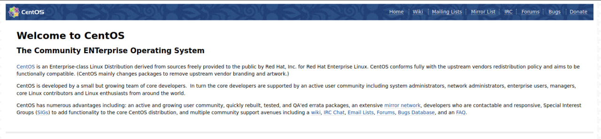

#  Лабораторная работа по написанию Ansible скрипта
## Письменная информация о файлах

### Конфигурационного файл "ansible.cfg"
В конфигурационном файле добавляем параметры:
1. Добавляем созданный inventory файл
2. Добавляем "vagrant" пользователя для работы
3. Значение "host_key_checking" ставим False
4. Значение defualt_transport указываем "smart"

### Playbook epel.yml
Playbook epel.yml, выполняет операцию по установке пакетов "epel", на заданной машине, в нашем случае "webserver".

### Создание inventory файла
С помощью "inventory" файла будет указанно на каких хостах нужно выполнить сценарий "ansible", в нашем случае указываем хост ip, путь до приватного ключа веб - сервера nginx. Для проверки значений можно использовать команду "vagrant ssh-config".

### Шаблон для конфигурационного файла nginx.conf.j2 на машине
Данный файл представляет из себя шаблон конфигурационного файла веб-сервера nginx. В нем указанны параметры расположения "html" файла на веб-сервере nginx, а также просушиваемый порт.

### Playbook nginx.yml
Установка epel и nginx репозитории на заданной машине, а также создание конфигурационного файла nginx по заранее прописанному шаблону "nginx.conf.j2" на машине, с последующим перезапуском службы.

## Запуск сценариев
#### 1. Убедимся в работоспособности машины
Прописав "vagrant status", узнаем о текущем состоянии виртуальной машины. Если машина не запущенна, то требуется выполнить команду "vagrant up".
#### 2. Убедится в корректности введенных данных в конфигурационных файлах
Выполнив команду "vagrant ssh-config" проверим соответствие информации в файлах.
#### 3. Запуск плейбука epel.yml
Прописав команду "ansible-playbook epel.yml" убедимся в работоспособности сценария.
Вывод должен быть следующим:
"nginx                      : ok=2    changed=0    unreachable=0    failed=0    skipped=0    rescued=0    ignored=0"
#### 4. Запуск плейбука nginx.yml
Прописав команду "ansible-playbook nginx.yml" убедимся в работоспособности сценария.
Вывод должен быть следующим:
"nginx                      : ok=4    changed=0    unreachable=0    failed=0    skipped=0    rescued=0    ignored=0"

## Результат проделанной работы
Открытие веб-страницы по адресу <http://192.168.11.150:8080> должно происходить корректно, а также должно присутствовать следущее изображение

